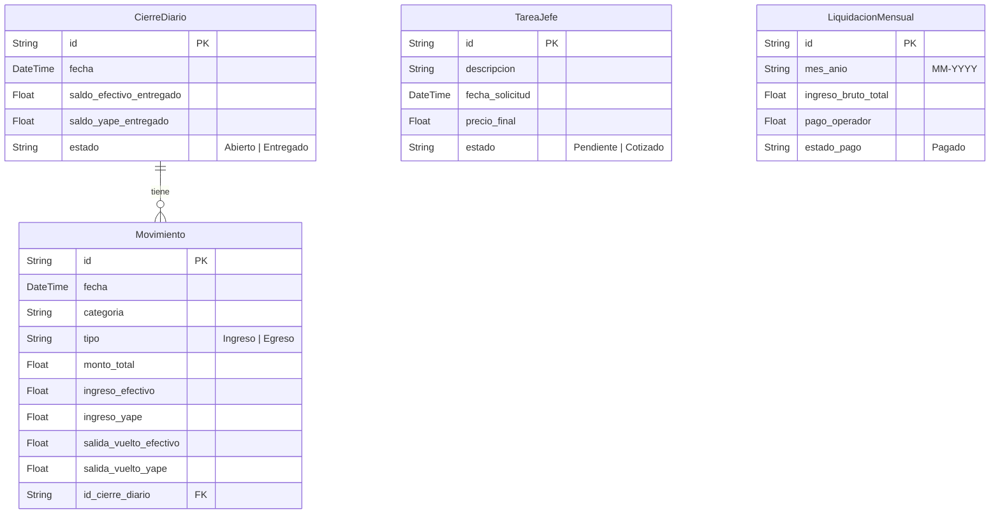

# 📑 SUPERPOS & CAJA DIGITAL - DOCUMENTACIÓN COMPLETA

¡Bienvenido a la documentación oficial de **SuperPOS & Cafe Digital v1.2**! Este documento proporciona la especificación técnica completa, el modelo de datos, la guía de arquitectura moderna, el manual de operaciones y los pasos para llevar el proyecto a producción con total confianza.

---

## 🏛️ 1. ARQUITECTURA MODERNA Y TECNOLOGÍAS

El proyecto ha sido diseñado bajo los estándares modernos de **Next.js 16**, optimizando el rendimiento mediante **Turbopack** y garantizando robustez a través de tipado estático estricto.

### **Stack Tecnológico Principal**
- **Framework:** Next.js 16.2 (App Router con Server Components y Server Actions).
- **Compilador/Empaquetador:** Turbopack (tiempos de desarrollo ultrarrápidos).
- **Lenguaje:** TypeScript (Tipado estático seguro a nivel de frontend, backend y base de datos).
- **Base de Datos:** SQLite (ligera, ideal para entornos locales y servidores POS).
- **ORM:** Prisma ORM (Migraciones automáticas, transacciones seguras y tipado estático autogenerado).
- **Estilos:** Tailwind CSS con variables HSL personalizadas para soporte de Dark Mode/Light Mode.
- **Gráficos & Métricas:** Recharts (paneles analíticos interactivos y fluidos).
- **Iconografía:** Lucide React.
- **Efectos de Sonido:** Sintetizador haptico de audio nativo (Web Audio API).

---

## 💾 2. MODELO DE BASE DE DATOS (ESQUEMA PRISMA)

El diseño de la base de datos asegura integridad referencial total. Toda acción de caja diaria (`Movimiento`) está ligada de forma jerárquica a un turno abierto (`CierreDiario`), y las cotizaciones externas se calculan en el ingreso bruto.

### **Diagrama de Relaciones**


---

## 🌟 3. CARACTERÍSTICAS PRINCIPALES IMPLEMENTADAS

### **A. Sistema de Alertas y Confirmaciones Personalizadas**
Para cumplir con las pautas de diseño premium, **se eliminaron todas las alertas nativas del navegador (`window.alert`, `window.confirm`)**. En su lugar, se implementaron:
- **Notificaciones Flotantes de Micro-feedback:** Toasts autodescartables con transiciones fluidas e interactividad de audio (chimes para éxito, acordes menores para fallos).
- **Modal de Confirmación Crítica Glassmorphic:** Diseñado con desenfoque de fondo premium, bordes degradados y animación de entrada y salida acelerada por hardware, para confirmaciones críticas (ej. restaurar copias de seguridad).

### **B. Control de Egresos Rápido (Gastos del Día)**
El operador o jefe puede registrar la compra de papel, tinta, materiales o almuerzos directamente desde la interfaz. 
- Los egresos restan automáticamente el balance esperado de caja.
- Permite especificar si el egreso se retiró de **Efectivo Físico** o de **Yape / QR**.
- Se guarda de forma automática en la lista de movimientos con la categoría `EGRESO: [CONCEPTO]`.

### **C. Respaldo y Restauración de Base de Datos (Backup JSON)**
Para prevenir pérdida de datos o facilitar migraciones:
- **Exportación:** Genera un archivo `.json` formateado con toda la base de datos (`CierreDiario`, `Movimiento`, `TareaJefe`, `LiquidacionMensual`) y firma de versión `1.0`.
- **Importación Segura:** Valida el esquema client-side. Antes de sobrescribir, despliega un **Modal de Confirmación Crítica** donde se le exige al usuario escribir la palabra clave `"IMPORTAR"` para evitar clics accidentales. La restauración se ejecuta en una sola transacción SQL atómica (`$transaction`) y recarga el terminal al finalizar de forma limpia.

### **D. Visualización Limitada para Operadores**
- El operador puede ingresar con su PIN (`1234`) y acceder a todas las funciones de venta (POS) y egresos rápidos.
- Puede visualizar la pestaña **Dashboard** de forma exclusiva de lectura para conocer el estado y ventas del mes, pero no tiene acceso a configuraciones críticas, cierres antiguos del jefe ni liquidaciones de pago de comisiones mensuales.

---

## 🛠️ 4. GUÍA DE INSTALACIÓN Y DESPLIEGUE EN PRODUCCIÓN

### **Paso 1: Clonar e Instalar Dependencias**
```bash
# Instalar dependencias mediante pnpm
pnpm install
```

### **Paso 2: Configuración de Variables de Entorno (`.env`)**
Crea un archivo `.env` en la raíz del proyecto con la siguiente configuración:
```env
DATABASE_URL="file:./dev.db"
```

### **Paso 3: Ejecutar Migraciones de Base de Datos**
Prisma se encargará de crear la base de datos SQLite localmente con todos los índices requeridos:
```bash
npx prisma db push
```

### **Paso 4: Compilación para Producción**
Para garantizar que el empaquetado optimice todas las páginas estáticas y compruebe la seguridad de tipos, ejecuta:
```bash
# Bypass de PowerShell en sistemas restringidos
powershell -ExecutionPolicy Bypass -Command "pnpm run build"
```
*Si estás en Linux/macOS, puedes ejecutar simplemente:*
```bash
pnpm run build
```

### **Paso 5: Levantar el Servidor POS**
```bash
pnpm run start
```

---

## 🔒 5. CREDENCIALES DE ACCESO POR DEFECTO (PINS DE SEGURIDAD)

El POS cuenta con un teclado virtual adaptativo. Los PINs de seguridad preconfigurados en la base de datos lógica son:

| Rol | PIN de Acceso | Permisos |
|---|---|---|
| **Operador (Vendedor)** | `1234` | Registrar Ventas, Gastos Rápidos (Egresos), Ver Dashboard de Ventas en modo de Solo Lectura. |
| **Administrador (Jefe)** | `0000` | Ver Historial de Cierres de Turno, Editar Estados de Tareas, Pagar Liquidaciones Mensuales, Descargar/Restaurar Backups. |

---

## 🚀 6. PLAN DE MANTENIMIENTO RECOMENDADO

1. **Backups Semanales:** Se recomienda al Administrador descargar el archivo `.json` de respaldo al finalizar cada semana laboral.
2. **Cierre de Caja Diario:** Al final de cada jornada de trabajo, el operador debe cerrar la caja diaria ingresando el efectivo físico contado en el conteo interactivo. Esto bloquea las transacciones de ese día y genera un **Ticket de Arqueo** imprimible mediante ticketera térmica.
3. **Control de Sesión:** Si la terminal se queda inactiva por más de 10 minutos (tiempo personalizable en el panel de configuración), se bloqueará automáticamente solicitando el PIN de acceso del operador o jefe nuevamente.

---
*Desarrollado con pasión para brindar la mejor experiencia digital en puntos de venta y control de caja diarios.*
