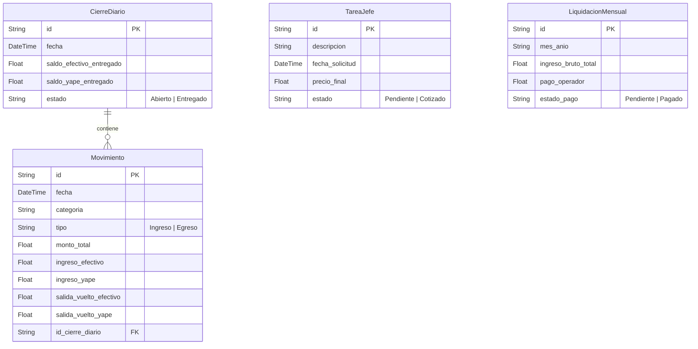

# ☕ SUPERPOS & CAJA DIGITAL - SISTEMA POS Y CONTROL DE CAJA

[](https://nextjs.org)
[](https://www.typescriptlang.org)
[](https://prisma.io)
[](https://sqlite.org)
[](https://tailwindcss.com)

Un sistema de Punto de Venta (POS) y Arqueo Diario de Caja de alto rendimiento, diseñado específicamente para **Digital Cafés, Centros de Internet y Servicios Digitales**. Construido bajo una arquitectura moderna, segura, interactiva y con un diseño estético ultra-premium.

---

## 🌟 Características Destacadas

### 🔒 1. Teclado Virtual Numpad & Seguridad de Doble Rol
* **Bloqueo de Terminal Seguro:** Pantalla de autenticación glassmórfica inicial que impide accesos no autorizados.
* **Autenticación Fisiológica de Rol:**
  * **Operador (PIN `1234`):** Permiso para registrar transacciones de venta, comisiones, control de arqueo y egresos rápidos.
  * **Administrador / Jefe (PIN `0000`):** Permiso completo para visualizar reportes analíticos mensuales de Dashboard, gestionar liquidaciones de sueldo de comisiones, ver arqueos históricos y descargar o restaurar backups.
* **Autorización Modal Rápida:** Si un operador intenta ingresar a la sección restringida de Dashboard, se despliega un modal flotante para ingresar temporalmente el PIN de autorización del Jefe sin cerrar el turno ni la sesión del operador.

### 🪙 2. Gestión de Egresos Rápidos (Gastos del Día)
* Botón de acceso inmediato para registrar compras urgentes (ej. tinta de impresora, papel térmico, insumos) directamente desde el terminal de cobros.
* Permite seleccionar el medio de retiro: **Efectivo Físico** o **Yape / QR**.
* Resta de forma automática los balances internos de caja previniendo descuadres en la rendición final.

### 📥 3. Copia de Seguridad y Restauración Segura (Backups JSON)
* **Exportar:** Descarga un archivo de respaldo `.json` firmado con versión `1.0` y toda la data histórica consolidada.
* **Restauración Atómica:** Carga un backup validándolo del lado del cliente.
* **Filtro Anti-Error:** Para confirmar la restauración destructiva de base de datos, el sistema le exige al administrador ingresar la palabra clave `"IMPORTAR"` en un modal crítico escarlata. La inserción se realiza bajo una única transacción SQL atómica (`$transaction`) garantizando cero pérdidas de información ante caídas de servidor.

### 📊 4. Dashboard Analítico de Solo Lectura para Operadores
* Los operadores pueden ingresar a ver el Dashboard y visualizar los gráficos de Recharts sobre servicios digitales populares, balances de caja del mes en curso y metas diarias.
* Las opciones de edición y pago de comisiones se encuentran bloqueadas con PIN de administrador.

### 🔊 5. Sintetizador de Tonos Hápticos POS
* Utiliza **Web Audio API** nativo para reproducir retroalimentación de sonidos inmersivos:
  * *Ding-Ding* brillante para ventas exitosas.
  * *Acorde menor* para alertas de error o PIN incorrecto.
  * *Swoosh* ascendente para logins aprobados.
* Alternador en cabecera (ícono de taza de café) para silenciar/activar el sonido con persistencia en `localStorage`.

### 📄 6. Voucher Térmico POS 80mm de Alta Fidelidad
* Plantilla de impresión simulada en ticketera térmica comercial de 80mm real.
* Incluye bordes punteados simulando corte de papel, logo retro minimalista de taza de café en código ASCII y códigos de barras responsivos generados en CSS nativo.

---

## 🏛️ Estructura del Modelo de Base de Datos (Prisma ORM)



---

## 🛠️ Instalación y Configuración Local

### **Requisitos Previos**
* Node.js v20 o superior.
* pnpm instalado (`npm i -g pnpm`).

### **Paso 1: Clonar e instalar dependencias**
```bash
git clone https://github.com/tu-usuario/nombre-repositorio.git
cd nombre-repositorio
pnpm install
```

### **Paso 2: Variables de Entorno**
Crea un archivo `.env` en la raíz del proyecto y define el enlace de base de datos SQLite:
```env
DATABASE_URL="file:./dev.db"
```

### **Paso 3: Inicializar Base de Datos**
Prisma empujará la arquitectura de tablas directamente:
```bash
powershell -ExecutionPolicy Bypass -Command "npx prisma db push"
```

### **Paso 4: Ejecutar en Desarrollo**
```bash
pnpm run dev
```
Abre [http://localhost:3000](http://localhost:3000) en tu navegador.

### **Paso 5: Compilación de Producción**
```bash
powershell -ExecutionPolicy Bypass -Command "pnpm run build"
pnpm run start
```

---

## 🔑 Credenciales de Acceso por Defecto

| Rol | PIN de Acceso | Pestañas Disponibles |
|---|---|---|
| **Operador (Vendedor)** | `1234` | Venta (POS), Tareas del Jefe, Cierre (Solo abrir/con conteo interactivo), Dashboard (Solo Lectura). |
| **Administrador (Jefe)** | `0000` | Todas las anteriores, Historial de Cierres (Reimpresiones), Panel de Liquidaciones Mensuales, Ajustes (Sonido, Inactividad, Backups). |

---
*Desarrollado con amor para la automatización financiera y auditorías de caja impecables.*
